# hse21_hw3

Ссылки на первую и вторую часть дз:

https://colab.research.google.com/drive/1kxUDfJm7ev9lCCWModYWixFcRTg7X1PP?usp=sharing
https://colab.research.google.com/drive/1tOjZ_7_mUbpHUPe1LuW2z-FwuwbNsai6?usp=sharing

Теперь к статистике из multiqc:

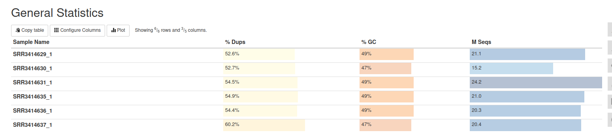
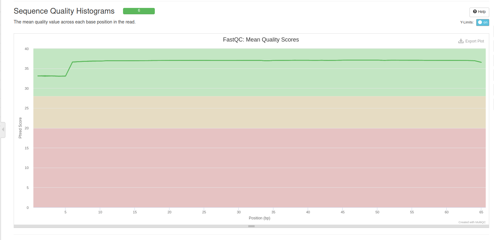
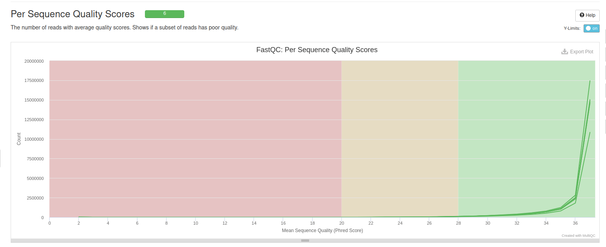
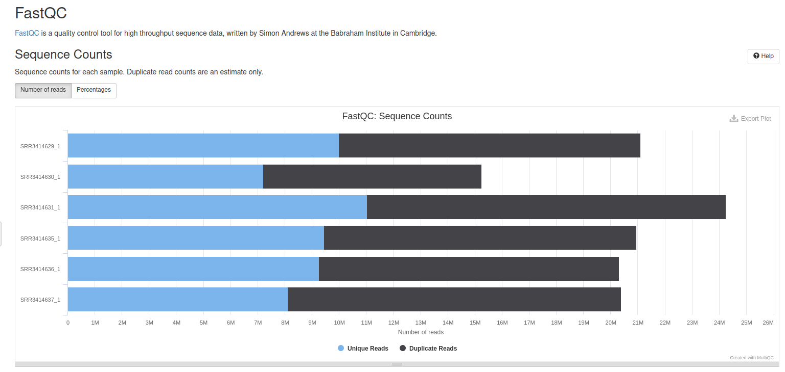
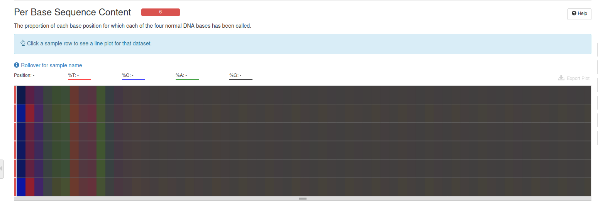
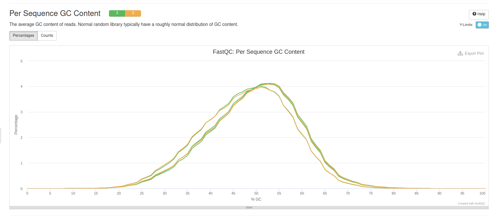
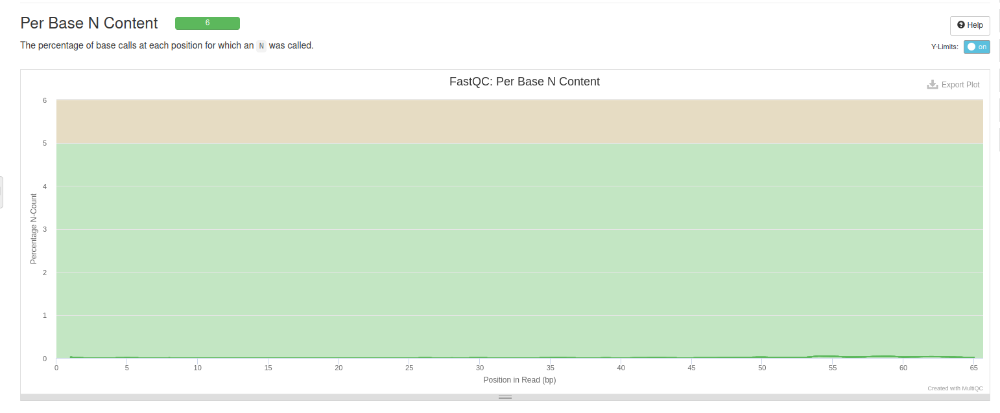
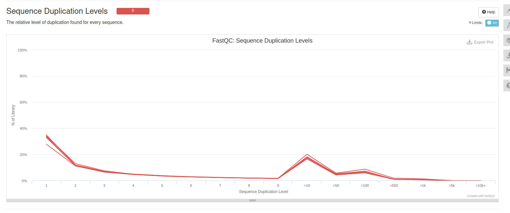

Как можно видеть, слегка аномальным является GC-баланс у половины образцов, а также достаточно аномальным является количество дупликаций.

Таблица с результатами эксперимента

| ID образца | Тип образца           | Общее кол-во исходных чтений | Не откартированы | Откартированы уникально | Откартированы неуникально | Откартированы | _no_feature | __ambiguous | Попали на гены |
|------------|-----------------------|------------------------------|------------------|-------------------------|---------------------------|---------------|-------------|-------------|----------------|
| SRR3414629 | Контрольный           | 21106089                     | 595976           | 18375888                | 2134225                   | 20510113      | 1604107     | 722172      | 16049609       |
| SRR3414630 | Контрольный           | 15244711                     | 412031           | 13186139                | 1646541                   | 14832680      | 1240295     | 480520      | 11465324       |
| SRR3414631 | Контрольный           | 24244069                     | 696383           | 20928945                | 2618741                   | 23547686      | 1700354     | 819740      | 18408851       |
| SRR3414635 | Перепрограммированный | 20956475                     | 560610           | 18428317                | 1967548                   | 20395865      | 1392186     | 760134      | 16275997       |
| SRR3414636 | Перепрограммированный | 20307147                     | 550088           | 17825380                | 1931679                   | 19757059      | 1332692     | 735108      | 15757580       |
| SRR3414637 | Перепрограммированный | 20385570                     | 538279           | 17844858                | 2618741                   | 20463599      | 1397650     | 710230      | 15736978       |

MA-plot:
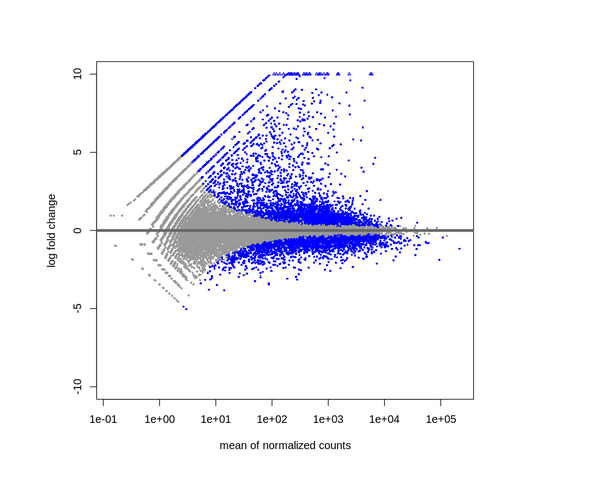

Heatmap:
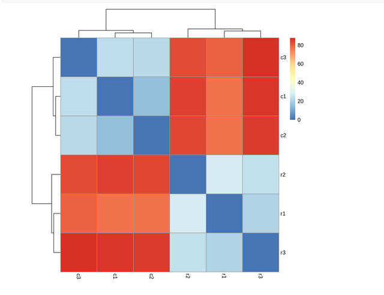

Графики для генов, наиболее поменявших экспрессиюё
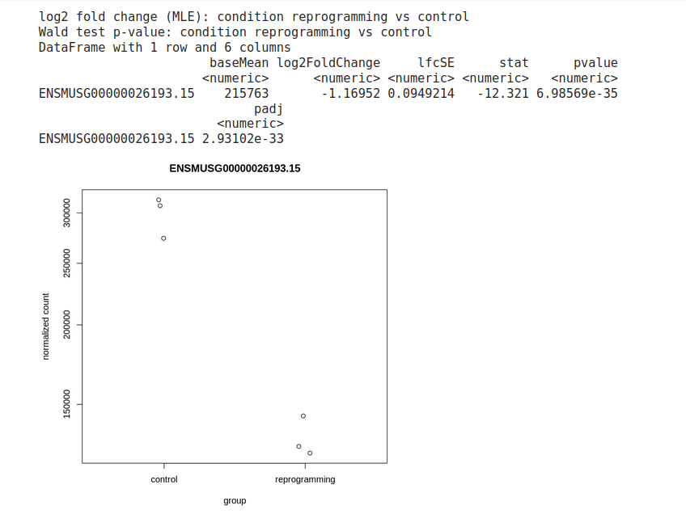
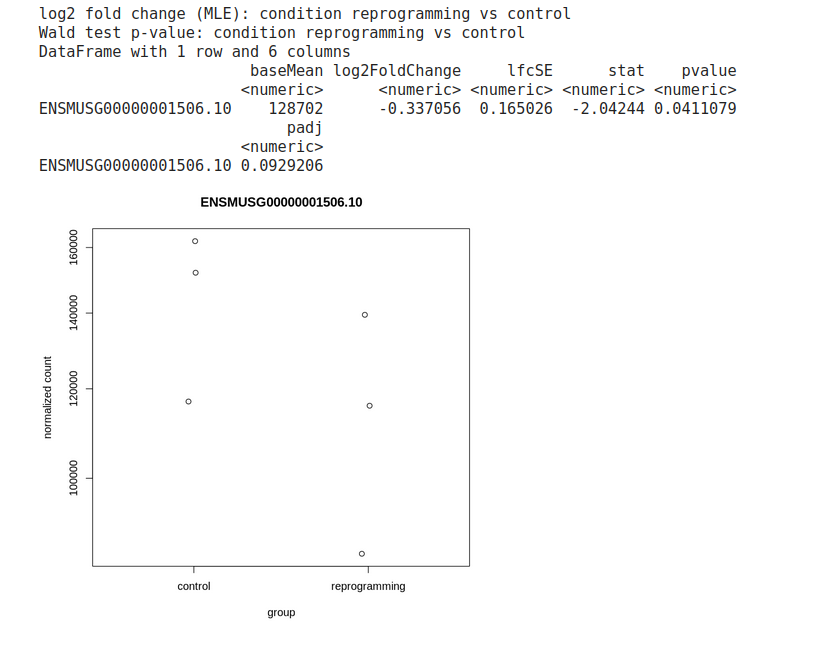
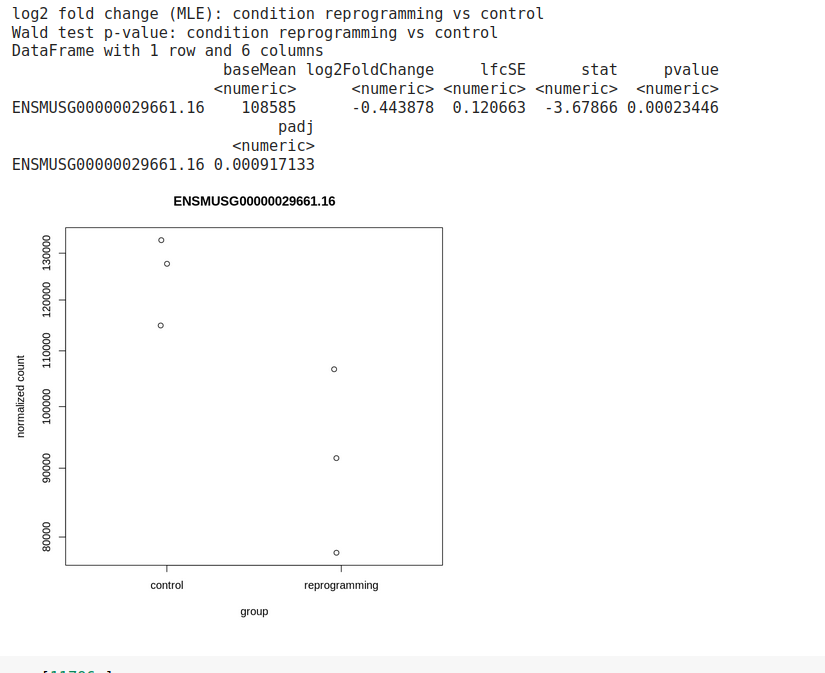
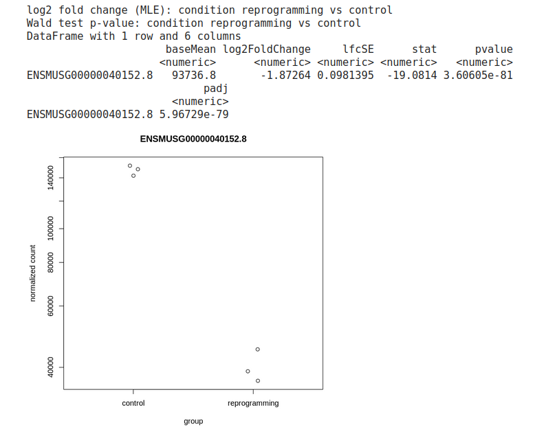
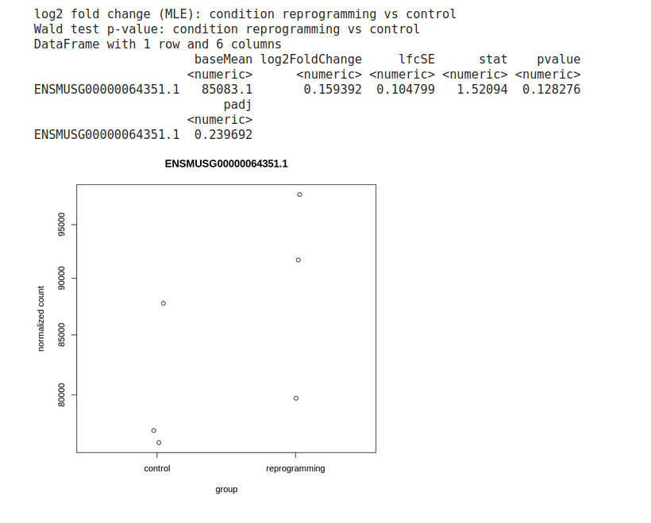
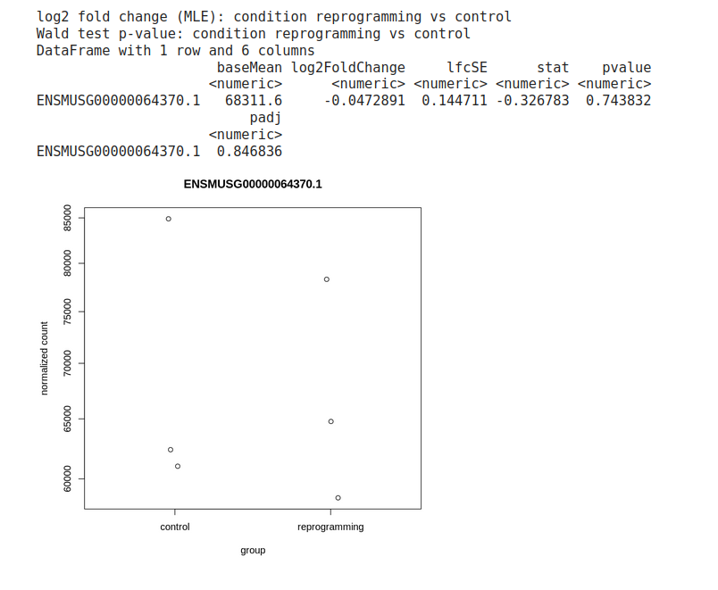